| Course: 3870 – Secure Web Development
| Activity: Exam 3
| Name: Ben Kobiske [kobiskeb@uwplatt.edu], David Touray [tourayd@uwplatt.edu]
| Professor: Dr. Abraham Aldaco
| Date: 2025-11-22

## Vite Configuration

Vite build configuration showing the development server setup and build options.

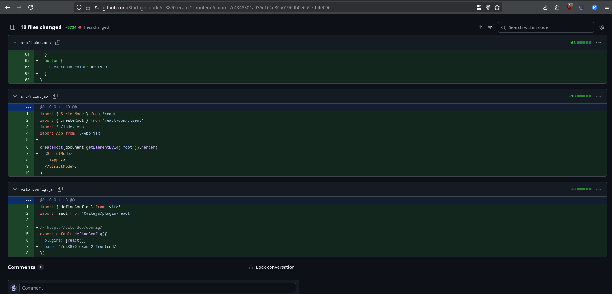{width=50%}

## Package.json Configuration

Package dependencies and scripts configuration for the project.

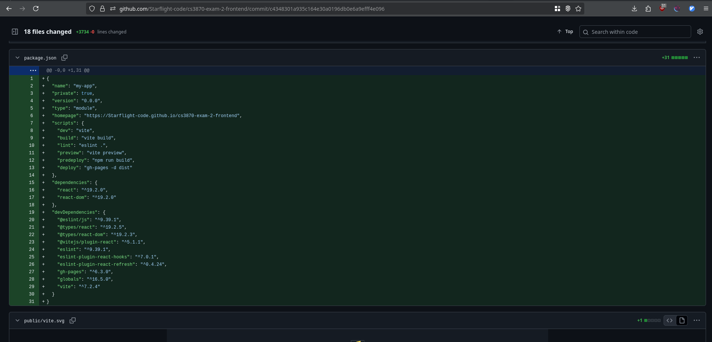{width=50%}

## GitHub Frontend Repository

GitHub repository view showing the frontend project structure and files.

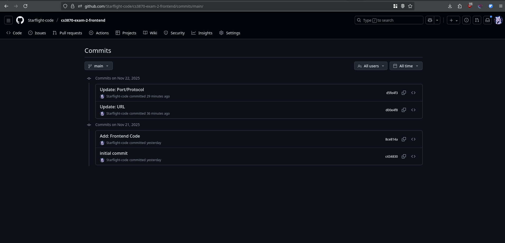{width=50%}

## Backend Deployment

Backend deployment configuration showing the deployment settings and environment.

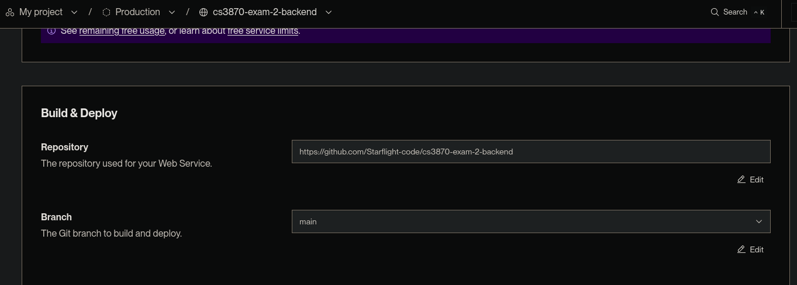{width=50%}

## Backend Build Deployment

Backend build process showing the deployment build configuration.

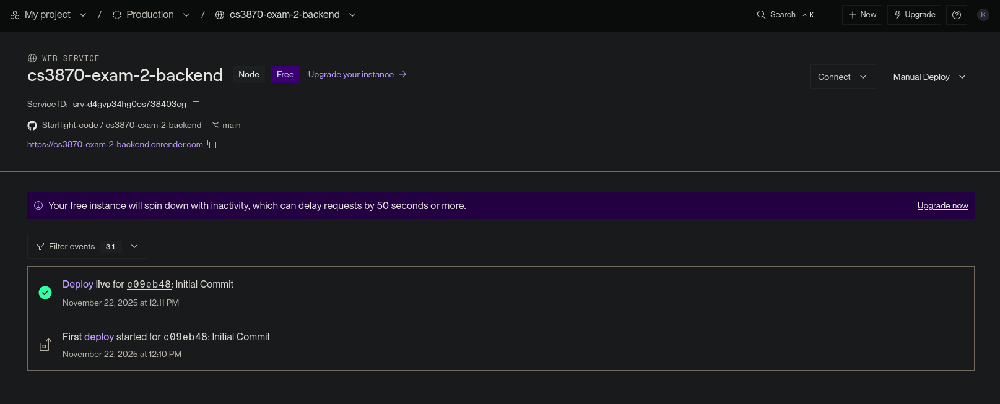{width=50%}

## Backend Environment Variables

Backend environment variables configuration showing sensitive data setup.

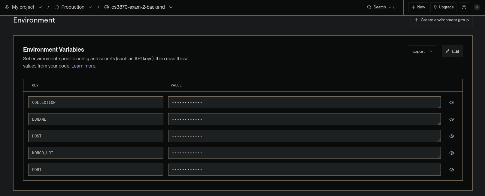{width=50%}

## Backend Dotenv Configuration

Backend dotenv file showing local environment variable configuration.

{width=50%}

## Backend Gitignore

Backend gitignore file showing files and directories excluded from version control.

{width=50%}

## MongoDB IP Configuration

MongoDB IP whitelist configuration showing allowed IP addresses for database access.

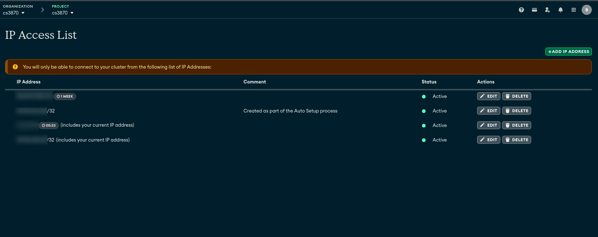{width=50%}

## Pages Home

Home page view showing the main application interface.

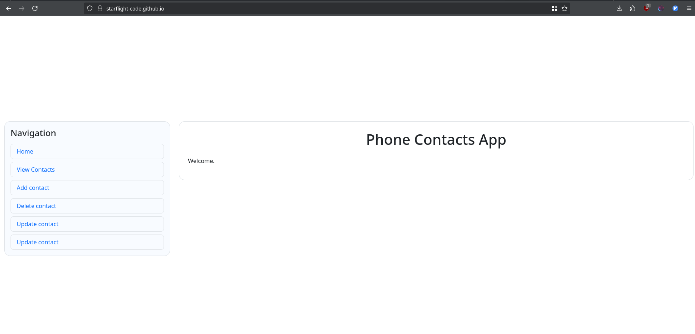{width=50%}

## Pages MongoDB Connection

MongoDB connection configuration page showing database connection settings.

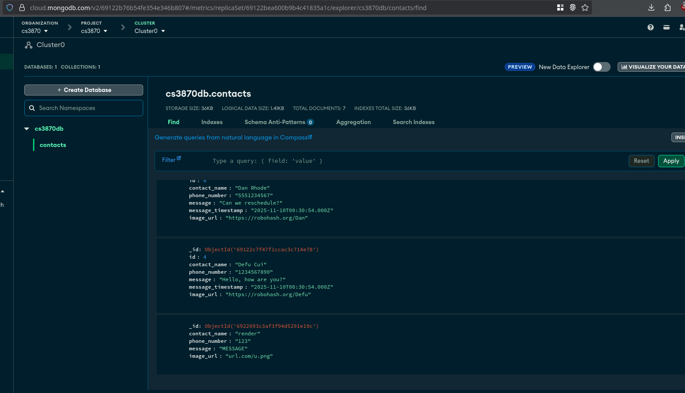{width=50%}

## Pages Deployment

Pages deployment configuration showing the deployment settings and status.

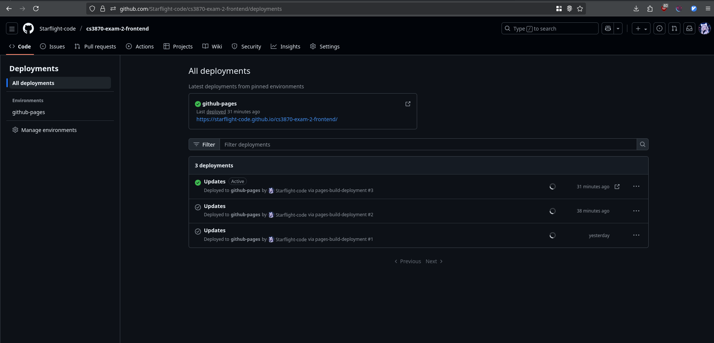{width=50%}

## Pages Final View

Final pages view showing the completed application interface.

{width=50%}

## Pages POST Request

POST request demonstration showing data submission to the backend API.

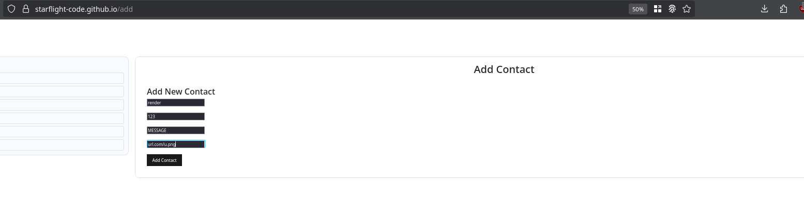{width=50%}

## Pages PUT Request

PUT request demonstration showing data update operation to the backend API.

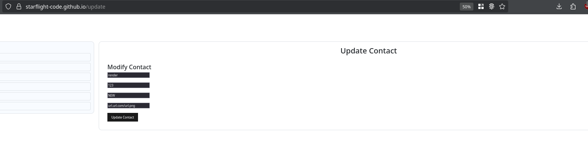{width=50%}

## Pages DELETE Request

DELETE request demonstration showing data deletion operation from the backend API.

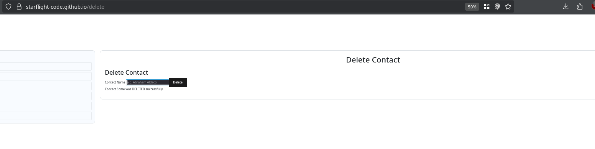{width=50%}

## Local GET Request

Local GET request demonstration showing data retrieval from the local backend.

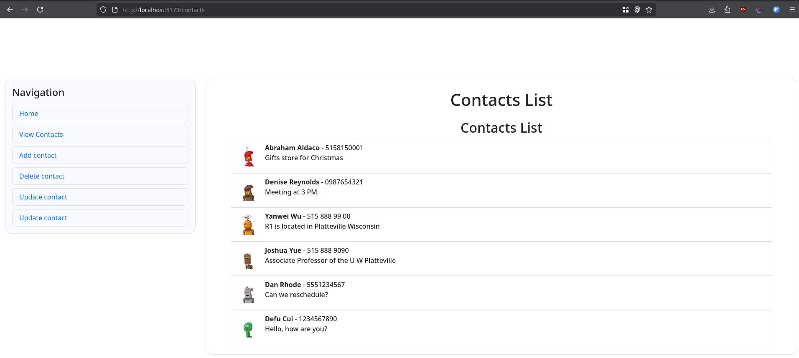{width=50%}

## Local POST Request

Local POST request demonstration showing data creation on the local backend.

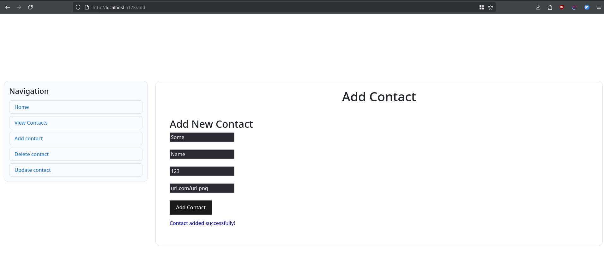{width=50%}

## Local PUT Request

Local PUT request demonstration showing data update on the local backend.

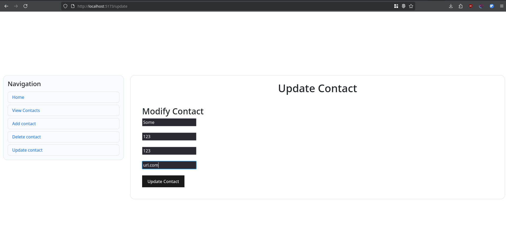{width=50%}

## Local DELETE Request

Local DELETE request demonstration showing data deletion from the local backend.

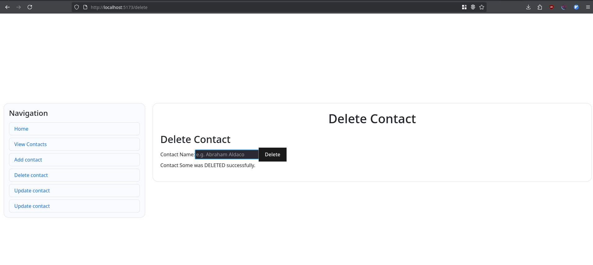{width=50%}

## Local Final View

Local final view showing the completed local application interface.

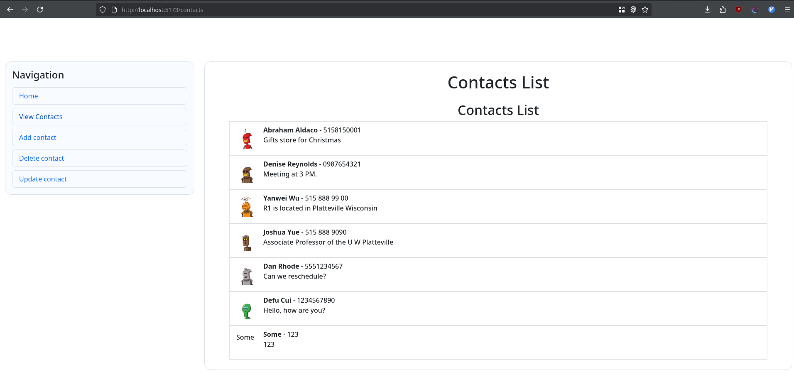{width=50%}

## Render GET Request

Render GET request demonstration showing data retrieval from the deployed backend on Render.

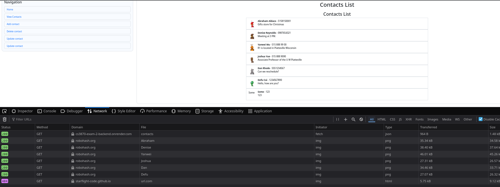{width=50%}

No AI tools were used in this project.